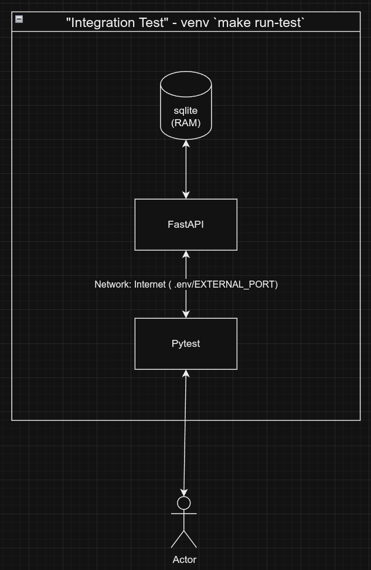

python3 -m venv venv
source venv/bin/activate

pip install pip-tools

echo "fastapi
uvicorn
sqlalchemy
alembic
pydantic" > requirements.in

pip-compile --upgrade

pip install -r requirements.txt

alembic init alembic
alembic revision --autogenerate -m "Initial migration"
alembic upgrade head

## Getting Started

The easiest way to get started is to copy `.env.template` to `.env`
and use `make run-in-cluster` to run as a docker-compose cluster or 
`make run-locally` if you are running in a Python venv
or `make test` to run tests

## Config

Your .env file allows you to set most configurable items for all supported run modes.

## Documentation & Test UI

Available at `/docs` of the app, via Swagger, e.g `localhost:5000/docs`

## Supported Run Configurations

The supported run configurations are:
1. Prod (For a fake prod setup I am using docker-compose to spin up a real mysql and redis server) - *Supports changing python version between 3.9 and 3.10 via .env file.*
2. Local (For local setup I am just using pip and venv with a file on disk database)
3. Testing (For testing I am using pytest with an in-memory database) 

These are all supported via the Makefile

I wanted to show off Docker and spend time on that, but in reality the better way to support differing Python versions for all run modes would be to use Poetry, specifying the python version in `pyproject.toml`. As I say I am demonstrating a docker setup instead.

